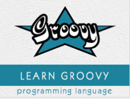

```
Roberto Nogueira  
BSd EE, MSd CE
Solution Integrator Experienced - Certified by Ericsson
```
# TutorialsPoint Groovy



**About**

`Groovy` is an object oriented language which is based on Java platform. `Groovy` 1.0 was released in January 2, 2007 with Groovy 2.4 as the current major release. Groovy is distributed via the Apache License v 2.0. In this tutorial, we would explain all the fundamentals of Groovy and how to put it into practice.

[Homepage](https://www.tutorialspoint.com/groovy/index.htm)

## Topics
```
Groovy Tutorial
[ ] Groovy - Home
[ ] Groovy - Overview
[ ] Groovy - Environment
[ ] Groovy - Basic Syntax
[ ] Groovy - Data Types
[ ] Groovy - Variables
[ ] Groovy - Operators
[ ] Groovy - Loops
[ ] Groovy - Decision Making
[ ] Groovy - Methods
[ ] Groovy - File I/O
[ ] Groovy - Optionals
[ ] Groovy - Numbers
[ ] Groovy - Strings
[ ] Groovy - Ranges
[ ] Groovy - Lists
[ ] Groovy - Maps
[ ] Groovy - Dates & Times
[ ] Groovy - Regular Expressions
[ ] Groovy - Exception Handling
[ ] Groovy - Object Oriented
[ ] Groovy - Generics
[ ] Groovy - Traits
[ ] Groovy - Closures
[ ] Groovy - Annotations
[ ] Groovy - XML
[ ] Groovy - JMX
[ ] Groovy - JSON
[ ] Groovy - DSLS
[ ] Groovy - Database
[ ] Groovy - Builders
[ ] Groovy - Command Line
[ ] Groovy - Unit Testing
[ ] Groovy - Template Engines
[ ] Groovy - Meta Object Programming
Groovy Useful Resources
[ ] Groovy - Quick Guide
[ ] Groovy - Useful Resources
[ ] Groovy - Discussion
[ ] Selected Reading
[ ] Developer's Best Practices
[ ] Questions and Answers
[ ] Effective Resume Writing
[ ] HR Interview Questions
[ ] Computer Glossary
[ ] Who is Who
```
